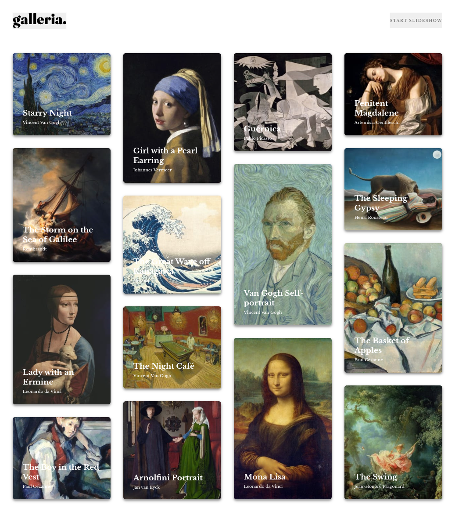
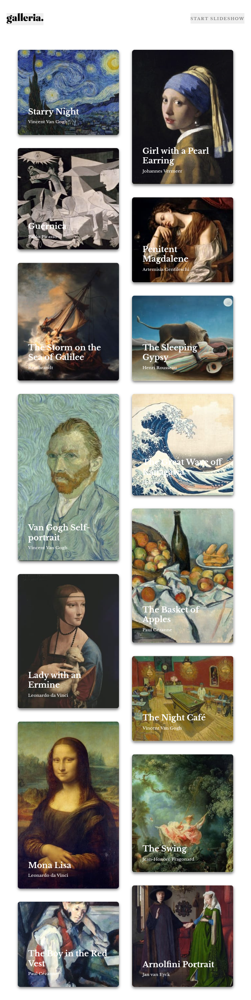

# Galleria Slideshow Site


## Features

- **Interactive Gallery Grid**: Browse 15 famous artworks in a responsive grid layout
- **Detailed Artwork View**: Click any artwork to see detailed information including:
  - High-resolution hero images with responsive loading
  - Artist information and portrait
  - Artwork description and historical context
  - Year of creation and Wikipedia source links
- **Slideshow Mode**: Automated slideshow with play/pause controls
- **Navigation Controls**: Previous/next buttons for manual artwork navigation
- **Modal View**: Full-screen image viewing capability
- **Responsive Design**: Optimized for desktop, tablet, and mobile devices
- **Accessibility**: ARIA labels, semantic HTML5, and keyboard navigation support
- **Performance**: Lazy loading images and efficient DOM manipulation

## Technologies Used

- **HTML5**: Semantic markup with accessibility features
- **SCSS**: Modular CSS with variables, mixins, and responsive design
- **JavaScript (ES6+)**: Modern JavaScript with modules and event delegation
- **CSS Grid & Flexbox**: Modern layout techniques
- **Web Components**: Native HTML elements like `<picture>` and `<dialog>`

## Project Structure

```
├── assets/
│   ├── css/           # Compiled CSS files
│   ├── js/            # Modular JavaScript files
│   ├── scss/          # SCSS source files
│   ├── images/        # Artwork images organized by piece
│   └── fonts/         # Custom fonts (Libre Baskerville)
├── data.json          # Artwork data structure
├── index.html         # Main HTML file
└── README.md          # This file
```

## Artworks Featured

The gallery includes 15 masterpieces 

## Getting Started

Since this is a static website, no build process is required:

1. Clone the repository
2. Open `index.html` in your browser
3. Or use a static server for development:
   ```bash
   python -m http.server 8000
   # or
   npx serve .
   ```

## Data Structure

Artwork information is stored in `data.json` with the following structure:

```json
{
  "name": "Artwork Title",
  "year": 1889,
  "description": "Artwork description...",
  "source": "Wikipedia URL",
  "artist": {
    "image": "path/to/artist/portrait.jpg",
    "name": "Artist Name"
  },
  "images": {
    "thumbnail": "path/to/thumbnail.jpg",
    "hero": {
      "small": "path/to/hero-small.jpg",
      "large": "path/to/hero-large.jpg"
    },
    "gallery": "path/to/gallery.jpg"
  }
}
```

### Screenshot





### Links

- Solution URL: [Add solution URL here](https://your-solution-url.com)
- Live Site URL: [Add live site URL here](https://rf1303.github.io/Galleria-slide-Show/)

### Built with

- Semantic HTML5 markup
- CSS custom properties
- Flexbox
- CSS Grid
- SCSS
- Mobile-first workflow
- JavaScript vanilla 

## Author

- FreeCodeCamp - [Add your name here](https://www.your-site.com)
- Frontend Mentor - [@yourusername](https://www.frontendmentor.io/profile/yourusername)
- Linkedin - [@yourusername](https://www.twitter.com/yourusername)


